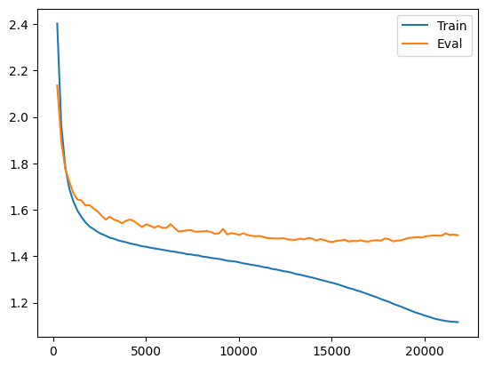
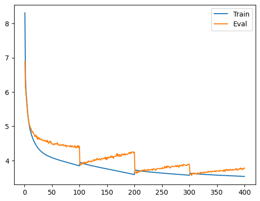

# Shakespeare GPT-2

Transformer arcitecture is written from scratch following youtube lectures by @karpathy. I have added my own small improvements such as data loader, learning rate schedules, byte-pair-encoding tokenizer ([bpe.py]() is taken from @karpathy [mingpt](https://github.com/karpathy/minGPT/tree/master), my own implementation of bpe is in tokenizers.py) etc. I've also added a general training terminal interface and wrapped everything into classes and separate modules.

For training, I used GPT 2 model parameters and trained on all of Shakespeare, essentially following the lectures.

Some training examples, plots and text generated by trained models can be found in the colab notebook [run.ipynb]().

## Usage

Models can be trained using run.py file. For example, from the notebook we run:

```
%run run.py \
--tokenizer_type 'bpe' \
--batch_sizes 32 \
--block_sizes 128 \
--num_epochs 100 \
--learning_rates 1e-4 \
--weight_decays 3 \
--dropouts 0.2 \
--save_losses \
--save_checkpoint \
--run_dir "./from_checkpoint_lr5e-5" \
--lr_schedule 'cosine' \
--cosine_final_lr 1e-8 \
--cosine_T_max 100
```


One can also do hyperparameter search by passing multiple arguments. For example, we can do runs with several learning rates:

```
%run run.py \
--tokenizer_type 'bpe' \
--batch_sizes 32 \
--block_sizes 128 \
--num_epochs 100 \
--learning_rates 1e-3 5e-4 1e-4 \
--weight_decays 3 \
--dropouts 0.2 \
--save_losses \
--save_checkpoint \
--run_dir "./from_checkpoint_lr5e-5" \
--lr_schedule 'cosine' \
--cosine_final_lr 1e-8 \
--cosine_T_max 100
```

Arguments that support multiple inputs are: 
* `batch_sizes`
* `block_sizes`
* `learning_rates`
* `weight_decays`
* `dropouts`
* `cosine_final_lr`
* `cosine_T_max`
* `cosine_T_mult`
* `cosine_lr_restart_decay`

The full set of options are:

```
%run run.py \
--n_emb 384 \
--n_heads 6 \
--n_blocks 6 \
--tokenizer_type 'bpe' \ # or 'chrs'
--batch_sizes 32 \
--block_sizes 128 \
--num_epochs 100 \
--learning_rates 1e-3 5e-4 1e-4 \
--weight_decays 3 \
--dropouts 0.2 \
--save_losses \
--save_checkpoint \
--run_dir "./from_checkpoint_lr5e-5" \
--from_checkpoint \
--from_checkpoint_run_dir "checkpoint_dir" \
--from_checkpoint_step 300 \
--lr_schedule 'cosine' \ # or 'const' or 'cosine_warm_restarts'
--cosine_final_lr 1e-8 \
--cosine_T_max 100 \
--cosine_T_mult 1 \
--cosine_lr_restart_decay 2
```

## Results

### Character-level model

The simplest case is to train the model on the next character prediction. Here I take GPT2 architecture After some basic hyperparameter search, the best eval loss run is: 

**The best eval loss is 1.46**

Sample generated text:


> KING RICHARD II:<br>
> What say you? in Citizen? why, ho! no; and thou that?<br>
> Wrank my baot, what you alone bitcher.<br>
> <br>
> KING RICHARD III:<br>
> Well, she now lies my discourse; what I should dismempt<br>
> Upon of your right, to note makes have conceit tongue<br>
> With with all alls my father's king; for seem me<br>
> contriment: what else were we coffer'd to repent,<br>
> And, mine own whom I dost shall weep thee.<br>
> <br>
> BUCKINGHAM:<br>
> I will say her mouth be from high from life.<br>
> <br>
> KING HENRY VI:<br>
> I not know, this is not uncle thought,<br>
> Three, the prince, Warwick, and the present;<br>
> You shall give a certain's far in.<br>
> <br>
> Second Murderer:<br>
> Ay, in Waft stays, candal, Bolingbroke.<br>
> <br>
> GLOUCESTER:<br>
> Prevure me, pardon! what sheften? he shall and their champion<br>
> gracious bs you woes burne<br>
> And part the masks for frae royal brother.<br>
> To we hear miserable young Tybalt,' this you are<br>
> babeTraganity, that banished these men than years<br>
> She is nothing; traitors, lest dream disposing<br>
> Of yoppression. Your prisoners of you are well<br>
> monging for thund authority<br>
> Of my bisposing pevil, bave I me so<br>
> endurged we.<br>
> <br>
> LADY CAPULET:<br>
> Ay, well.<br>
> <br>
> MENENIUS:<br>
> Well, sir.<br>
> <br>
> CORIOLANUS:<br>
> Well, west my thou<br>
> wilt I meet offence me ignoble to see them.<br>


### Byte-pair-encoding tokenizer

My own implementation of BPE is in [tokenizers.py](tokenizers.py). Karpathy's implementation is [bpe.py](bpe.py) (which is itself based on OpenAI implementation). For training I mainly used the latter.

After a short hyperparameter search, the best eval loss run I found with GPT-2 model is:  Learning rate is decreased by half every 100 epochs (hence the sharp discontinuities in the plot). 

**The best eval loss is 3.56**

Sample generated text:

> We was dared to his father, but, report<br>
> Your all any great death: I have eve.<br>
> <br>
> CALUS:<br>
> It was at the king, 'twere now, for this;<br>
> It sends she: eat what's, to heaven,--<br>
> Come, sir,Need boast his weeds oftenBR<br>
> 3 KING sore distribution, lend him<br>
> <br>
> MEN highumentle<br>
> Thus his five men,<br>
> We shall follow him.<br>
> ThirdBeing nor;<br>
> <br>
> CORIUS:<br>
> Nightless soil, are too now we depsal robbers into<br>
> Betw got in charity; for they shall of<br>
> the home: woodency, and yet he is it hence,<br>
> You never sh E miscar councils, to be most one thing,<br>
> <br>
> To answer the traitors and unhappy, rel withheld.<br>
> <br>
> First wealsdigy,<br>
> We, Marcius the Lord:<br>
> 'ld never lacks truth that nothing of the memory,<br>
> His inherunes answer'd by the present sight o' the<br>
> Of the coronible: believe, here, that<br>
> Which we do eyedoser, but had esteemfully,<br>
> Our which weeps by his impartial sides priixt his<br>
> Upon my kindred years to a woman's model of saw,<br>
> Groyet fear not winter love;BIANDA:<br>
> Sweet nurse, by you have,<br>
> Or courOf then, their garments, meets far have soarse,<br>
> To the blood for to- suspect.<br>
> <br>
> Second Senator:<br>
> O noble lord, the't is;<br>
> ert high of feNor to demand, medicine<br>
>  brought you but the st blarest:<br>
> Is my cousin, I'Tis dead. it not amongst the Gloucester no,<br>
> A dumbly is soon; and every corel reckoning wouldmet<br>
> MENENIUS:<br>
> MineMIO, drunk,<br>
> I may so lawful Roman read.<br>


It seems that the eval loss is high and we're underfitting.The model might benefit if we make it bigger.
